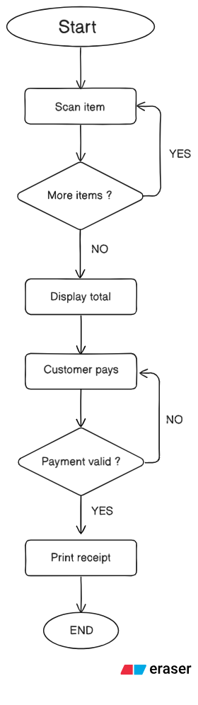

<H1> PSEUDOCODE </H1>
<h2> 
Pseudocode for store checkout after purchase
START
    Set Total = 0
    
    // Loop to handle multiple items
    REPEAT
        INPUT Barcode
        FETCH Item Price
        Total = Total + Item Price
        OUTPUT "Item Added. Current Total: " + Total
        OUTPUT "Are there more items? (Yes/No)"
        INPUT Answer
    UNTIL Answer = "No"
    
    OUTPUT "Please pay: " + Total
    
    // Payment process
    REPEAT
        INPUT PaymentDetails
        VALIDATE PaymentDetails
    UNTIL Payment is Successful
    
    OUTPUT "Payment Successful. Thank you!"
    PRINT Receipt
END
</h2>

<h1> FLOWCHART </h1>
<h1><h/1>

